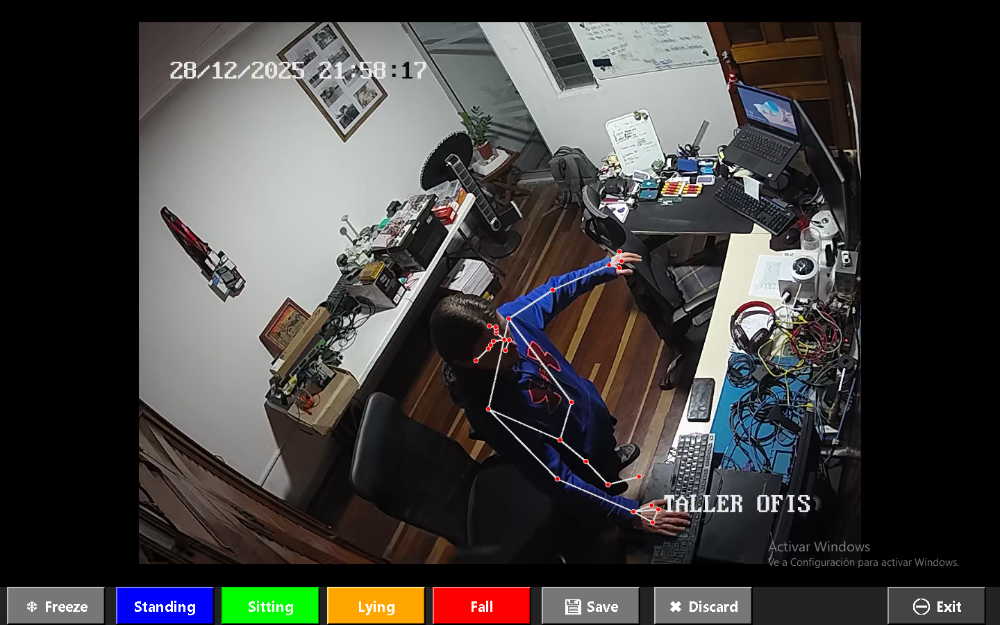

# 🧠 Sistema de Visión Artificial y Control

Sistema de visión artificial y control desarrollado con **FastAPI, OpenCV, MediaPipe y cámaras ONVIF**, con clasificación de poses mediante **IA (TensorFlow)**.

Este documento describe paso a paso cómo instalar, entrenar y ejecutar el sistema en una nueva computadora.

---

## 📦 Requisitos

### Python
- **Python 3.10 o superior**

Verificar instalación:
```bash
python --version
```

Descarga: https://www.python.org/downloads/

### Git (opcional)
Solo requerido si vas a clonar o modificar el repositorio.

Verificar:
```bash
git --version
```

Descarga: https://git-scm.com/install/windows 

### Sistema Operativo
- **Windows 10 / 11** 
Requerido para generar `.exe`

### Visual Studio Code (opcional)
Editor recomendado para desarrollo.

Descarga: https://code.visualstudio.com/

---

## 📥 1. Clonar repositorio

```bash
git clone https://github.com/Bojtronic/Cameras-Software-Security.git
cd Cameras-Software-Security
```

---

## 🧪 2. Crear entornos virtuales

Se utilizan **dos entornos**:

| Entorno | Uso |
|-------|-----|
| `venv-train` | Entrenamiento de IA y generación del modelo |
| `venv` | Ejecución del sistema y generación del ejecutable |

Ir a la carpeta del proyecto:

```bash
cd Cameras-Software-Security/Web_Server_Stream_Video
```

Crear entornos:

```bash
python -m venv venv-train
python -m venv venv
```

---

## 📚 3. Instalar dependencias

### 🔹 Entrenamiento de IA

```bash
venv-train\Scripts\activate
pip install -r requirements-train.txt
deactivate
```

### 🔹 Runtime y servidor

```bash
venv\Scripts\activate
pip install -r requirements.txt
pip install -r requirements-dev.txt
deactivate
```

---

## 🧠 4. Flujo del modelo IA

### 4.1 Crear Dataset

Activar entorno de entrenamiento:

```bash
venv-train\Scripts\activate
```

Ejecutar:

```bash
python -m "modelo pose.dataset_builder"
```

Esto abre una ventana con el video en streaming de la camara en la que se usará el sistema
Previamente se debe haber configurado el enlace rtsp hacia la camara
Esta interfaz permite: 

- Congelar la imagen con la pose que se desea agregar al dataset presionando el boton `Freeze`
- Etiquetar la imagen con los botones `Standing` (Azul), `Sitting` (Verde), `Lying` (Naranja) y `Fall` (Rojo)
- Si ha habido un error en la imagen seleccionada se puede descartar con el boton `Discard`
- Cuado se tiene la imagen adecuada correctamente etiquetada, se procede a guardar los datos de la pose presionando el boton `Save`
- Para detener la generación de datos al dataset se presiona el boton `Exit`
- Si se vuelve a ejecutar este script, los nuevos datos se continuan agregando al archivo csv para hacer mas grande el set de datos




Esto genera el archivo:

pose_dataset.csv


---

### 4.2 Entrenar modelo

```bash
python -m "modelo pose.create_model"
```

Se generará el modelo:

pose_model.h5


---

### 4.3 Reentrenar modelo (opcional)

```bash
python -m "modelo pose.retrain_model"
```

Esto mejora el modelo usando nuevos datos.

Recordar siempre desactivar este entorno virtual despues de crear el modelo pues no se debe mezclar con el entorno virtual de ejecución y construcción 

```bash
deactivate
```

---

## ▶️ 5. Ejecutar el sistema

```bash
venv\Scripts\activate
python run_ui.py
```

Luego abre en el navegador:
```
http://localhost:8000
```

---

## 🏗 6. Generar ejecutable (.exe)

Ir a la carpeta que contiene los archivos fuente

```bash
cd Cameras-Software-Security/Web_Server_Stream_Video
```

Se debe acitivar el respectivo entorno virtual

```bash
venv\Scripts\activate
```

Ejecutar el comando para generar el .exe

```bash
pyinstaller run.spec
```

El ejecutable se genera en:
```
/dist/
```

---

## 📦 7. Distribución

La carpeta:
```
dist/
```
Contiene:
- El `.exe`
- Todas las dependencias necesarias

No requiere Python instalado en la máquina destino.

---

## 🛡 Reglas importantes

- ❌ No mezclar entornos
- `requirements-train.txt` → Entrenamiento IA
- `requirements.txt` → Desarrollo y Producción
- `requirements-dev.txt` → Compilación


---

## 📞 Soporte

Correo **bojtronic@gmail.com**  
